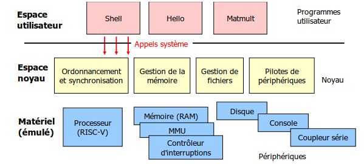

# NachosOS
Build a simple emulated OS

Nachos internal structure

NachOS est un système d’exploitation écrit en C++.  
L’intérêt est de pouvoir manipuler directement les composants d’un OS (threads, mémoire, IO)  en testant et déboguer notre code.

Le projet est compsé de deux parties:

- 🔹 TP1 : les **mécanismes de synchronisation entre threads**
- 🔹 TP2 : la **gestion des communications série** avec l’ACIA (console asynchrone)
ans ce premier TP, nous avons implémenté les mécanismes de **synchronisation entre threads** dans NachOS.  
Ce travail nous a permis de comprendre comment fonctionnent :
- les **sémaphores**,
- les **verrous (locks)**,
- les **variables de condition**,
- ainsi que la création, le démarrage, l’attente, et la terminaison de threads.

---

## 📁 Fichiers modifiés et fonctions implémentées

---

### 🔹 `kernel/synch.h` et `kernel/synch.cc`

####  `Semaphore::P()` (wait)
- Désactive les interruptions
- Décrémente le compteur du sémaphore
- Si le compteur devient négatif, le thread courant est bloqué (ajouté à `waiting_queue`)
- Rétablit le statut des interruptions

####  `Semaphore::V()` (signal)
- Désactive les interruptions
- Incrémente le compteur
- Si des threads sont en attente, le premier est réveillé
- Rétablit le statut des interruptions

---

####  `Lock::Acquire()`
- Si le verrou est libre, le thread courant le prend
- Sinon, il est ajouté à la file d’attente et mis en sommeil

####  `Lock::Release()`
- Si le thread courant possède le verrou, il le libère
- Si d’autres threads attendent, on en réveille un et on lui donne le verrou

####  `Lock::isHeldByCurrentThread()`
- Renvoie vrai si le thread courant détient le verrou

---

####  `Condition::Wait()`
- Le thread courant est ajouté à la file d’attente de la condition et endormi

####  `Condition::Signal()`
- Réveille un thread en attente sur la condition (s’il y en a)

####  `Condition::Broadcast()`
- Réveille tous les threads en attente sur la condition

---

### 🔹 `kernel/thread.cc` et `kernel/thread.h`

####  `Thread::Start()`
- Initialise le contexte du thread
- Alloue une pile
- Ajoute le thread dans la liste des threads actifs (`g_alive`)
- L’ajoute dans le scheduler (état prêt)

####  `Thread::Finish()`
- Utilisé à la fin d’un thread
- Affiche un message de debug
- Met le thread en sommeil (n’est pas complètement supprimé dans notre version)

####  `Thread::Yield()`
- Le thread courant cède le processeur volontairement à un autre thread prêt
- S’il y a un autre thread prêt, il est planifié et on effectue un `SwitchTo`

####  `Thread::RestoreProcessorState()`  
- Restaure les registres du processeur à partir du contexte du thread
- Nécessaire pour que le thread reprenne son exécution correctement

####  `Thread::SaveProcessorState()`  
- Sauvegarde les registres du thread courant avant un switch

